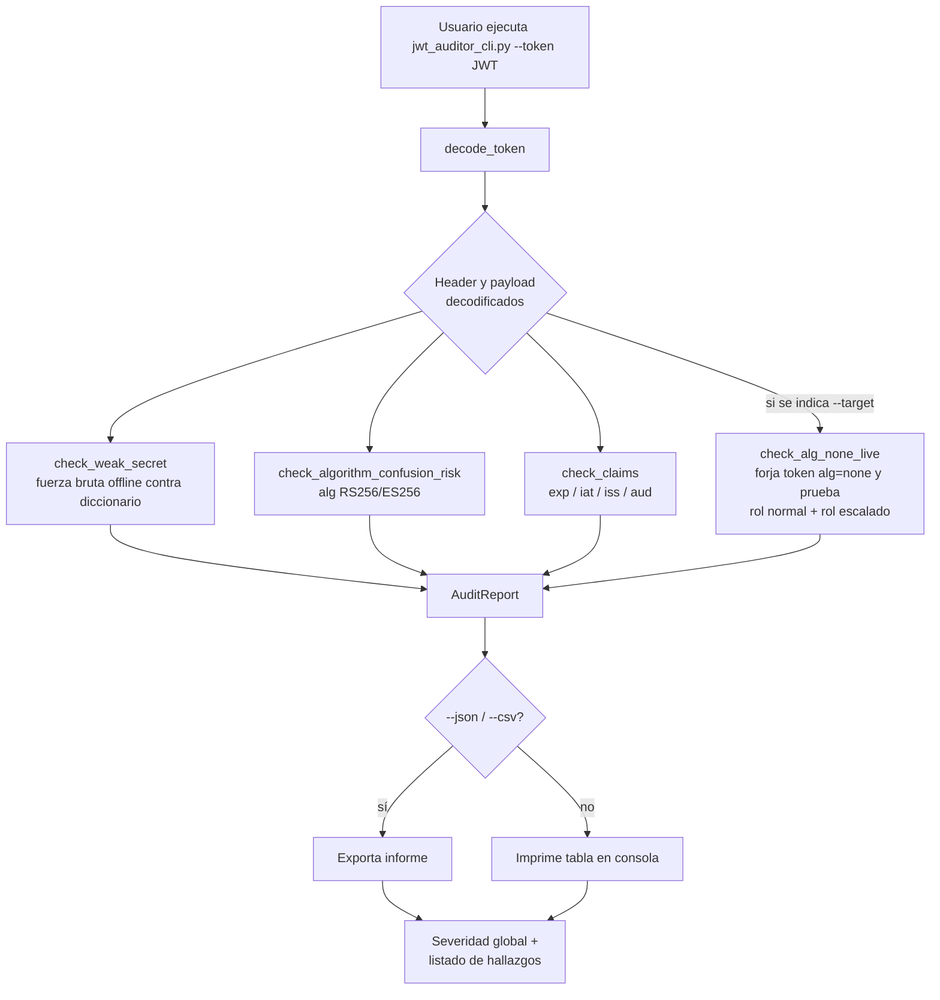

# JWT Security Auditor

**Máster en Desarrollo Seguro DevSecOps — Módulo 10: Ingeniería de la Identidad**
**Tarea colaborativa — Automatización de detección de vulnerabilidades**

Autor: Esteban Segui

---

## 1. Descripción del proyecto

**JWT Security Auditor** es una herramienta defensiva de línea de comandos,
escrita en Python 3 (sin dependencias externas), que analiza automáticamente
un token JWT y detecta varias de las vulnerabilidades más comunes en su
implementación, en lugar de tener que comprobarlas manualmente una por una.

La herramienta **no ataca ni modifica ningún sistema real**: se limita a
analizar el token proporcionado y, opcionalmente, a comprobar contra un
endpoint de prueba si acepta tokens `alg=none` forjados por la propia
herramienta con fines defensivos/de auditoría.

### Comprobaciones automatizadas

| Check | Qué detecta | Severidad si falla |
|---|---|---|
| `weak_secret` | Secreto HMAC (HS256/384/512) presente en un diccionario de valores comunes | Critical |
| `algorithm_confusion_risk` | Uso de algoritmos asimétricos (RS256/ES256) que podrían ser vulnerables a confusión de algoritmo | Medium |
| `alg_none_live` *(opcional, requiere `--target`)* | El servidor acepta un token `alg=none` sin firma, incluso escalando privilegios (`role: admin`) | Critical |
| `claim_exp_missing` | El token no incluye fecha de expiración | High |
| `claim_iss_missing` / `claim_aud_missing` | Ausencia de emisor/audiencia, impidiendo restringir el uso del token | Low |
| `claim_iat_future` | El claim `iat` está en el futuro (anómalo) | Medium |

## 2. Diagrama de funcionamiento



## 3. Escenarios de prueba incluidos

Para poder demostrar y comparar el comportamiento de la herramienta, se
incluyen dos servidores Express de ejemplo en `scenarios/`:

- **`scenario_vulnerable.js`** (puerto 3000): usa el secreto débil `"secret"`
  y acepta `alg=none`.
- **`scenario_seguro.js`** (puerto 3001): usa un secreto robusto generado
  aleatoriamente, whitelist explícita de algoritmos (`jwt.verify` con
  `algorithms: ["HS256"]`), y valida `iss`/`aud`/`exp`.

### Resultado sobre el escenario vulnerable

```
CHECK                        SEVERIDAD  RESULTADO    DETALLE
----------------------------------------------------------------------------------------------------
weak_secret                  critical   VULNERABLE   Secreto HMAC encontrado por diccionario: 'secret'
algorithm_confusion_risk     info       OK           Algoritmo 'HS256' no es asimétrico...
claim_exp_valid              info       OK           El token tiene fecha de expiración válida...
claim_iss_missing            low        VULNERABLE   El token no incluye el claim 'iss'...
claim_aud_missing            low        VULNERABLE   El token no incluye el claim 'aud'...
alg_none_live                critical   VULNERABLE   El servidor aceptó un token alg=none sin firma
                                                       (HTTP 200) con payload role=admin escalado.

Resultado global: 4 hallazgo(s) de riesgo. Severidad máxima: CRITICAL
```

### Resultado sobre el escenario seguro

```
CHECK                        SEVERIDAD  RESULTADO    DETALLE
----------------------------------------------------------------------------------------------------
weak_secret                  info       OK           Ninguno de los 11 secretos del diccionario coincide...
algorithm_confusion_risk     info       OK           Algoritmo 'HS256' no es asimétrico...
claim_exp_valid              info       OK           El token tiene fecha de expiración válida...
alg_none_live                info       OK           El servidor rechazó todos los intentos con alg=none.

Resultado global: sin hallazgos de riesgo.
```

## 4. Instalación y uso

### Requisitos
- Python 3.9+ (sin dependencias externas, solo librería estándar)
- Node.js (opcional, solo si quieres levantar los escenarios de prueba)

### Analizar un token sin conexión (offline)

```bash
python3 jwt_auditor_cli.py --token "eyJhbGciOiJIUzI1NiIs..."
```

### Analizar un token y probar en vivo si el servidor acepta `alg=none`

```bash
python3 jwt_auditor_cli.py --token "eyJhbGciOiJIUzI1NiIs..." --target http://localhost:3000/admin
```

### Usar un diccionario de secretos personalizado

```bash
python3 jwt_auditor_cli.py --token "..." --wordlist mis_secretos.txt
```

### Exportar el informe

```bash
python3 jwt_auditor_cli.py --token "..." --json informe.json --csv informe.csv
```

### Levantar los escenarios de prueba

```bash
cd scenarios
npm install
node scenario_vulnerable.js   # Terminal 1 — puerto 3000
node scenario_seguro.js       # Terminal 2 — puerto 3001
```

Luego, en otra terminal, obtén un token de cualquiera de los dos y audítalo
como se explica arriba.

## 5. Pruebas automatizadas

Se incluye una suite de **14 pruebas unitarias** (`unittest`, librería
estándar de Python) que cubren la decodificación de tokens, la detección
de secretos débiles, el riesgo de confusión de algoritmo, la validación de
claims y la orquestación completa del análisis.

```bash
python3 -m unittest discover -s tests -v
```

Salida esperada: `Ran 14 tests in 0.00Xs — OK`.

## 6. Estructura del repositorio

```
.
├── jwt_auditor/
│   ├── __init__.py
│   └── core.py            # Lógica de detección (motor)
├── jwt_auditor_cli.py      # Interfaz de línea de comandos
├── tests/
│   └── test_auditor.py     # 14 pruebas automatizadas
├── scenarios/
│   ├── scenario_vulnerable.js
│   ├── scenario_seguro.js
│   └── package.json
└── README.md
```

## 7. Limitaciones y alcance

- La herramienta **no se conecta a servidores de producción ni realiza
  cambios en ningún sistema**; el único tráfico de red que genera es, de
  forma opcional, una petición GET a la URL indicada en `--target` con un
  token forjado, para verificar de forma no destructiva si `alg=none` es
  aceptado.
- El diccionario de secretos por defecto es intencionadamente pequeño
  (fines educativos); en un uso real se recomendaría un diccionario más
  extenso tipo `rockyou.txt` filtrado.
- No implementa comprobación de confusión de algoritmo en vivo (RS256→HS256
  explotado activamente), solo advierte del riesgo teórico si el token usa
  un algoritmo asimétrico.

## 8. Referencias

- RFC 7519 — JSON Web Token (JWT)
- OWASP — JSON Web Token Cheat Sheet
- PayloadsAllTheThings — JSON Web Token
